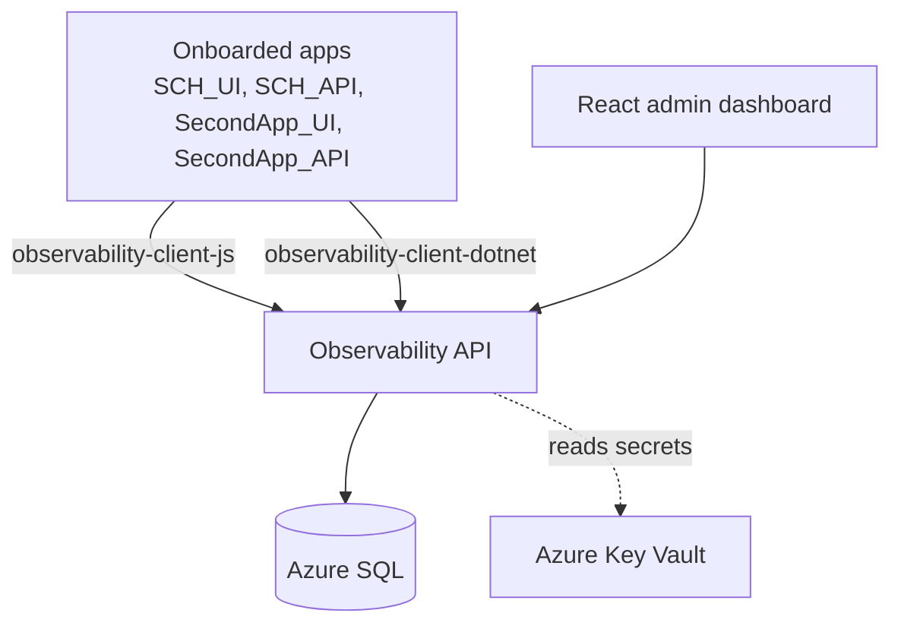

# Architecture

## Overview

`adaptive-observability` is an internal platform that ingests safe events and errors from onboarded apps' frontend and backend SDKs, persists them in Azure SQL, and surfaces them in a React admin dashboard.

It replaces an already-shipped PostHog Phase 1 integration in SCH. Contracts (event names, identity rules, allowed property shapes, route normalization) are preserved verbatim from `POSTHOG_EVENT_CATALOG.md` so SCH migration is mechanical.

## Components

## Ingestion path

1. SDK collects a safe event/error (allowlist already enforced client-side as a soft check).
2. SDK sends to `POST /api/ingest/events` or `POST /api/ingest/errors` with `X-Observability-Key` header.
3. Auth middleware resolves the API key hash → `Application` + `AppEnvironment` + `KeyType`.
4. Correlation ID middleware accepts incoming `X-Correlation-Id` or generates a ULID.
5. Allowlist validator drops unknown property keys; rejects known-forbidden keys with a `SafetyViolations` row.
6. Persisted to `Events` or `Errors`. Errors are fingerprinted; repeats increment `OccurrenceCount`.
7. 202 Accepted returned.

## Dashboard path

1. React app authenticates (Phase 8 RBAC; placeholder login for MVP).
2. Filter bar selects `Application` + `AppEnvironment` + date range.
3. Pages call `/api/dashboard/*` and `/api/sessions/*` server-side queries.
4. Recharts renders sparklines. CSV export available on event explorer.

## Onboarding path

1. Admin opens dashboard `Admin > Apps`.
2. Registers `Application` (slug, name) and per-environment config (`Development`, `UAT`, `Production`).
3. Generates two keys per environment: `public_client` (FE) and `server_api` (BE). Plaintext shown once.
4. App owner installs SDK, sets `init({ host, key, environment, releaseSha })`, deploys.

## Deployment topology

| Env  | App Service                         | SQL                  | Key Vault                  |
|------|-------------------------------------|----------------------|----------------------------|
| Dev  | local docker-compose / `app-obs-dev`| docker mssql / Az SQL| `kv-observability-dev`     |
| UAT  | `app-obs-uat`                       | Az SQL UAT           | `kv-observability-uat`     |
| Prod | `app-obs-prod`                      | Az SQL Prod          | `kv-observability-prod`    |

Managed identity per App Service, scoped read on its same-environment Key Vault.

## Migration from PostHog (summary)

- SCH_API DI registration swaps `PostHogService` → `AdaptiveObservabilityService` (both implement `IAnalyticsService`).
- SCH_UI swaps `posthog.*` calls in `analytics.ts` for `observability-client-js` calls. API surfaces match.
- 5-business-day dual-write window in UAT validates parity.
- See `docs/migration/posthog-to-adaptive.md` (Phase 6).

## Open architectural questions

- **Materialized vs. derived session timeline** — decided in Phase 5.2 spike.
- **Ingestion queue** — in-process `Channel<T>` for MVP (Phase 1), Service Bus when RPS warrants (Phase 8.9).
- **Event-catalog source of truth** — leaning code (compile-time SDK safety) with a generated markdown view; final decision pending.
